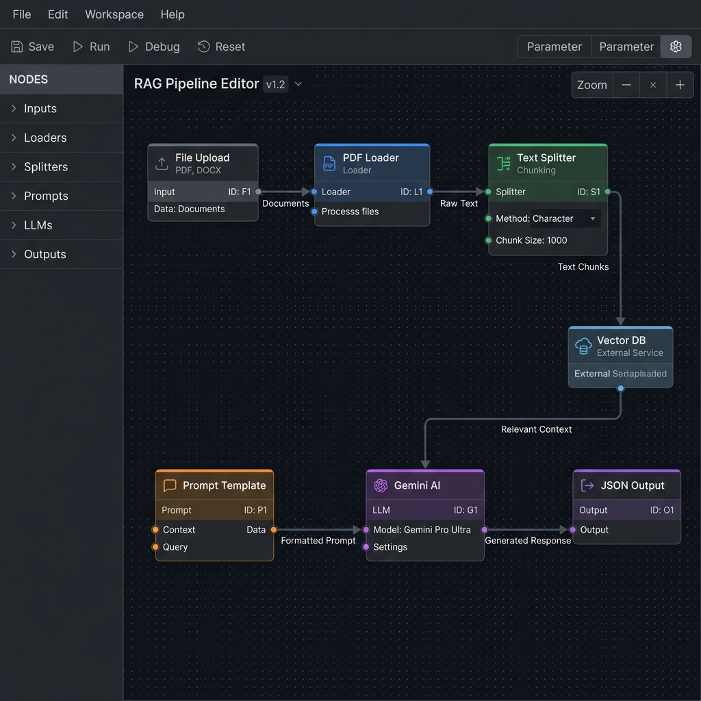
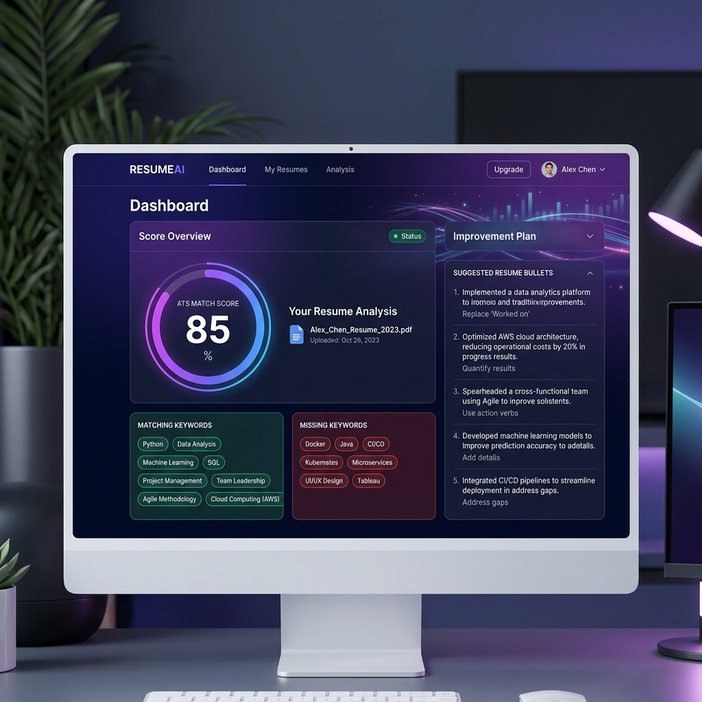
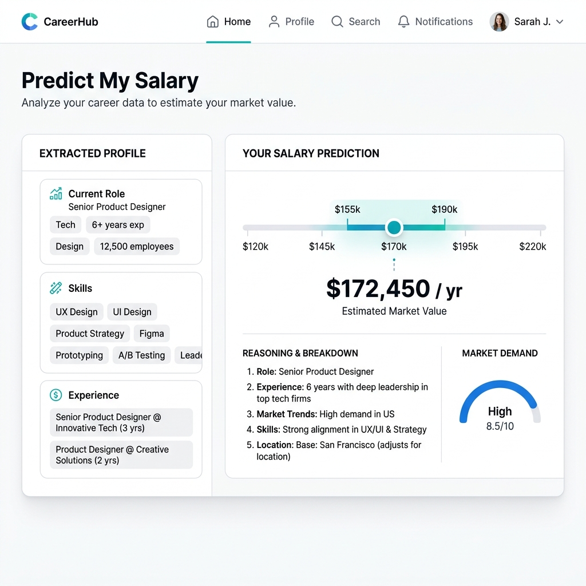

# ResumeIQ — AI Resume Analyzer + Salary Predictor

> **Live Demo:** _https://resumeiq.vercel.app_ (update after Vercel deployment)

ResumeIQ is a full-stack, AI-powered application that analyzes your resume against a job description using a Retrieval-Augmented Generation (RAG) pipeline, calculates an ATS match score, predicts your expected salary using live-scraped Indian market data, lets you compare two job descriptions side-by-side, and exports all improvement suggestions as a downloadable PDF.

---

## Table of Contents
- [Product Overview](#product-overview)
- [All Features](#all-features)
- [Project File Structure](#project-file-structure)
- [Tech Stack](#tech-stack)
- [Architecture & System Design](#architecture--system-design)
- [How Each Feature Works](#how-each-feature-works)
  - [1. Resume Parsing](#1-resume-parsing)
  - [2. RAG-Based ATS Analysis](#2-rag-based-ats-analysis)
  - [3. Company Keyword Detection](#3-company-keyword-detection)
  - [4. Salary Prediction Pipeline](#4-salary-prediction-pipeline)
  - [5. Live Salary Scraping](#5-live-salary-scraping)
  - [6. Multi-JD Comparison](#6-multi-jd-comparison)
  - [7. PDF Export](#7-pdf-export)
  - [8. Confidence Badge](#8-confidence-badge)
- [Data Sources — Where Info Comes From](#data-sources--where-info-comes-from)
- [API Endpoints Reference](#api-endpoints-reference)
- [Frontend Component Architecture](#frontend-component-architecture)
- [How to Run Locally](#how-to-run-locally)
- [How to Use All Features](#how-to-use-all-features)
- [Deployment](#deployment)
- [Screenshots](#screenshots)
- [Limitations](#limitations)
- [Interview Talking Points](#interview-talking-points)

---

## Product Overview

**Problem:** Job seekers don't know how well their resume matches a job posting, what keywords they're missing, or what salary to negotiate for.

**Solution:** Upload one PDF → paste a job description → get instant, AI-powered feedback:

| What You Get | How It Helps |
|---|---|
| ATS Score (0–100) | Know your match strength at a glance |
| Missing Keywords | Add these to improve your resume |
| Rewritten Bullets | Drop-in replacements optimized for the JD |
| Salary Range (Min–Median–Max) | Know your market worth before negotiating |
| Negotiation Tips | Actionable advice to get a better offer |
| Side-by-Side JD Comparison | Choose the best-fit role |
| PDF Download | Take your improvement tips offline |

---

## All Features

1. **ATS Match Scoring** — Contextual match score (0–100) using RAG + Google Gemini.
2. **Keyword Analysis** — Identifies matching strengths and missing keyword gaps.
3. **Bullet Rewriter** — AI-generated, optimized resume bullet points tailored to the JD.
4. **Company Keyword Detection** — Detects company name in JD (Amazon, Google, Microsoft, etc.) and surfaces their culture-specific keywords.
5. **Salary Predictor** — 3-step pipeline: role extraction → live web scraping → LLM prediction with Min/Median/Max in LPA.
6. **Confidence Badge** — Green (High), Yellow (Medium), Red (Low) badge on salary predictions.
7. **Multi-JD Comparison** — Paste two JDs, see side-by-side ATS scores with a "winner" banner.
8. **PDF Export** — Download all tips (ATS score, missing keywords, rewritten bullets, salary data) as `ResumeIQ_Tips.pdf`.
9. **Negotiation Tips** — Highlighted in a colored accent box.

---

## Project File Structure

```
resumeiq/
├── backend/
│   ├── .env                       # GEMINI_API_KEY (not committed)
│   ├── main.py                    # FastAPI app — all API endpoints
│   ├── resume_parser.py           # PDF text extraction via PyMuPDF
│   ├── rag_pipeline.py            # RAG chunking + Gemini analysis
│   ├── company_keywords.py        # Company-specific keyword mapping
│   ├── salary_predictor.py        # 3-step salary prediction pipeline
│   ├── salary_scraper.py          # Live web scraping (AmbitionBox, Glassdoor)
│   ├── salary_data.csv            # Fallback salary reference data
│   ├── render.yaml                # Render.com deployment config
│   ├── requirements.txt           # Python dependencies (pip freeze)
│   ├── test_resumes/              # Sample PDFs for testing
│   │   ├── software_engineer_resume.pdf
│   │   ├── data_analyst_resume.pdf
│   │   └── product_manager_resume.pdf
│   ├── test_rag.py                # Test script for /analyze endpoint
│   ├── test_salary.py             # Test script for /predict-salary
│   ├── test_salary_variants.py    # Tests fresher/senior/non-Indian profiles
│   ├── test_company_keywords.py   # Tests company keyword extraction
│   └── test_gemini.py             # Tests Gemini API connectivity
│
├── frontend/
│   ├── index.html                 # Entry HTML (Vite)
│   ├── package.json               # Node dependencies (React, axios, jsPDF)
│   ├── vite.config.js             # Vite configuration
│   └── src/
│       ├── main.jsx               # React entry point
│       ├── App.jsx                # Main application component (all UI logic)
│       ├── App.css                # Component styles
│       └── index.css              # Global styles
│
├── screenshots/
│   ├── langflow_pipeline.png      # Visual RAG architecture diagram
│   ├── app_ui_1.png               # ATS Analyzer dashboard screenshot
│   └── app_ui_2.png               # Salary Predictor screenshot
│
└── README.md                      # This file
```

---

## Tech Stack

| Layer | Technology | Purpose |
|---|---|---|
| **Frontend** | React 19 | UI components and state management |
| **Build Tool** | Vite 8 | Fast dev server and bundler |
| **HTTP Client** | Axios | API calls from frontend to backend |
| **PDF Generation** | jsPDF | Client-side PDF export |
| **Backend** | FastAPI | Python REST API framework |
| **Server** | Uvicorn | ASGI server for FastAPI |
| **AI / LLM** | Google Gemini (`gemini-1.5-flash`) | Resume analysis + salary prediction |
| **LLM Framework** | LangChain | Text splitting, prompt management |
| **Web Scraping** | requests + BeautifulSoup4 | Live salary data from Indian portals |
| **PDF Parsing** | PyMuPDF (`fitz`) | Extract text from uploaded PDFs |
| **Environment** | python-dotenv | Secure API key management |

---

## Architecture & System Design

### RAG Pipeline (Retrieval-Augmented Generation)

> Instead of sending the entire resume to Gemini (which is token-heavy and prone to losing context), I chunk it into 500-character sections with 50-character overlap, take the top 6 most relevant chunks, and combine them with the job description into a focused prompt. This reduces token cost and improves accuracy.



### System Flow Diagram
```
User Browser (React + Vite)
     │
     ├── Upload PDF ──────────────────────┐
     ├── Paste JD(s) ────────────────────┐│
     │                                    ││
     ▼                                    ▼▼
FastAPI Backend (Uvicorn @ port 8000)
     │
     ├── POST /parse-resume ──► PyMuPDF ──► Raw Text
     │
     ├── POST /analyze ──────► Text Chunking (500 chars, 50 overlap)
     │                          ├── Top 6 Chunks + JD + Company Keywords
     │                          └── Gemini 1.5 Flash ──► JSON Response
     │                              (ats_score, missing_keywords,
     │                               top_matches, rewritten_bullets,
     │                               company_keywords)
     │
     ├── POST /predict-salary ──► Step 1: Extract Role (Gemini)
     │                             Step 2: Scrape Market Data
     │                             │  ├── AmbitionBox
     │                             │  ├── Glassdoor India
     │                             │  └── Fallback: Gemini knowledge
     │                             Step 3: Predict (Gemini) ──► JSON
     │                             (min/median/max LPA, confidence,
     │                              reasoning, negotiation_tip)
     │
     └── POST /compare-jd ───► Runs /analyze twice (JD1 + JD2)
                                Returns side-by-side results
```

---

## How Each Feature Works

### 1. Resume Parsing
**File:** `backend/resume_parser.py`

```python
import fitz  # PyMuPDF

def extract_text_from_pdf(file_bytes: bytes) -> str:
    doc = fitz.open(stream=file_bytes, filetype="pdf")
    text = ""
    for page in doc:
        text += page.get_text()
    return text.strip()
```

- Accepts raw binary bytes from the uploaded PDF.
- Iterates through every page using PyMuPDF's `fitz` library.
- Returns a clean, concatenated string of all text content.
- The `/parse-resume` endpoint returns both the full text (`text`) and a preview (`text_preview` — first 1000 chars).

---

### 2. RAG-Based ATS Analysis
**File:** `backend/rag_pipeline.py`

```python
def analyze_resume(resume_text: str, job_description: str) -> dict:
    # Step 1: Chunk resume into 500-char blocks with 50-char overlap
    chunks = chunk_resume(resume_text)

    # Step 2: Select top 6 chunks as context
    context = '\n---\n'.join(chunks[:6])

    # Step 3: Get company-specific keywords from the JD
    company_kws = get_company_keywords(job_description)

    # Step 4: Send to Gemini with structured prompt
    prompt = f"""RESUME:\n{context}\n\nJOB DESCRIPTION:\n{job_description}\n
    Company-specific keywords: {', '.join(company_kws)}\n
    Respond ONLY with valid JSON:
    {{"ats_score": 0-100, "missing_keywords": [], "top_matches": [],
      "rewritten_bullets": [], "company_keywords": []}}"""

    response = llm.invoke(prompt)
    return json.loads(response.content)
```

**Why RAG?** Sending a 5-page resume to Gemini in one shot wastes tokens and dilutes focus. Chunking + selection gives the LLM only the most relevant sections alongside the JD, producing sharper keyword matching and more targeted bullet rewrites.

---

### 3. Company Keyword Detection
**File:** `backend/company_keywords.py`

```python
COMPANY_KEYWORDS = {
    'amazon':    ['ownership', 'customer obsession', 'dive deep', 'deliver results', 'bias for action'],
    'google':    ['scalability', 'data-driven', 'impact at scale', 'ambiguity'],
    'microsoft': ['growth mindset', 'inclusive', 'empowerment', 'clarity'],
    'flipkart':  ['first principles', 'speed', 'execution', 'consumer first'],
    'tcs':       ['agile', 'stakeholder management', 'delivery', 'SDLC'],
    'default':   ['leadership', 'collaboration', 'problem-solving', 'impact']
}

def get_company_keywords(jd: str) -> list:
    for company, kws in COMPANY_KEYWORDS.items():
        if company in jd.lower():
            return kws
    return COMPANY_KEYWORDS['default']
```

Scans the JD text for known company names. If detected (e.g., "Amazon"), it returns culture-specific keywords (e.g., "customer obsession", "dive deep") that are fed into the Gemini prompt to surface in the analysis results.

---

### 4. Salary Prediction Pipeline
**File:** `backend/salary_predictor.py`

A **3-step pipeline**:

```python
def predict_salary(resume_text: str) -> dict:
    # Step 1: Extract role title from resume using Gemini
    role = extract_role_from_resume(resume_text, llm)

    # Step 2: Scrape live market data for this role
    market_context = scrape_salary_data(role)

    # Step 3: Combine resume + market data → Gemini prediction
    prompt = f"""Resume: {resume_text[:2000]}
    Scraped Market Data for {role}: {market_context}
    Predict Indian IT salary in LPA..."""

    response = llm.invoke(prompt)
    return json.loads(response.content)
```

**Output JSON:**
```json
{
  "extracted_role": "Senior Software Engineer",
  "years_of_experience": 5,
  "college_tier": "Tier 1",
  "tech_stack": ["Python", "AWS", "Docker"],
  "min_salary_lpa": 18,
  "max_salary_lpa": 35,
  "median_salary_lpa": 25,
  "confidence": "High",
  "reasoning": "Based on 5 years experience with Python...",
  "negotiation_tip": "Highlight your AWS certifications..."
}
```

---

### 5. Live Salary Scraping
**File:** `backend/salary_scraper.py`

```python
def scrape_salary_data(role: str) -> str:
    formatted_role = role.lower().replace(" ", "-")

    # Target 1: AmbitionBox India
    ambitionbox_url = f"https://www.ambitionbox.com/salaries/{formatted_role}-salaries"

    # Target 2: Glassdoor India
    glassdoor_url = f"https://www.glassdoor.co.in/Salaries/{formatted_role}-salary-..."

    # HTTP GET with browser-like headers
    headers = {"User-Agent": "Mozilla/5.0 ..."}

    # Parse HTML with BeautifulSoup, extract salary snippets via regex
    matches = re.findall(r'.{0,50}(?:Lakhs|LPA|₹\s*[\d,]+).{0,50}', text)

    # Fallback if blocked
    if not context_data:
        return "Live scraping was blocked. Rely on pre-trained knowledge..."
```

**How it works:**
1. Takes the LLM-extracted role (e.g., "Software Engineer") and formats it for URLs.
2. Makes HTTP GET requests to AmbitionBox and Glassdoor India with browser-mimicking headers.
3. Parses the HTML with BeautifulSoup, then uses regex to extract text snippets containing "LPA", "Lakhs", or "₹" amounts.
4. Returns up to 5 relevant salary snippets per source as context for Gemini.
5. If anti-bot measures block the request, returns a fallback message telling Gemini to use its pre-trained Indian market knowledge.

---

### 6. Multi-JD Comparison
**Backend:** `POST /compare-jd` in `main.py`

```python
class CompareRequest(BaseModel):
    resume_text: str
    job_description_1: str
    job_description_2: str

@app.post("/compare-jd")
def compare_jd(req: CompareRequest):
    result1 = analyze_resume(req.resume_text, req.job_description_1)
    result2 = analyze_resume(req.resume_text, req.job_description_2)
    return {"status": "success", "data": {"jd1": result1, "jd2": result2}}
```

**Frontend:** Toggle "Compare Two JDs" mode → paste two job descriptions → both are analyzed against the same resume. Results are shown side-by-side with:
- Individual ATS scores, strengths, missing keywords, and bullet suggestions.
- A **winner banner** at the top: "🏆 Job Description 1 is a better fit (85 vs 62)".

---

### 7. PDF Export
**Frontend:** `App.jsx` using `jsPDF`

```javascript
import { jsPDF } from 'jspdf'

const handleDownloadPDF = () => {
  const doc = new jsPDF()

  // Title
  doc.text('ResumeIQ — Resume Improvement Tips', 15, 15)

  // ATS Score, Missing Keywords, Rewritten Bullets, Salary Data
  // Each section is added with proper formatting and page breaks

  doc.save('ResumeIQ_Tips.pdf')
}
```

Clicking the "📥 Download Improvement Tips (PDF)" button generates a clean, multi-page PDF containing:
- ATS Match Score
- Missing keywords (red)
- Your strengths (green)
- Rewritten bullet suggestions
- Salary prediction details
- Negotiation tip

---

### 8. Confidence Badge
The salary predictor returns a `confidence` field ("High", "Medium", or "Low"). The frontend renders it as a colored badge:

| Confidence | Color | Meaning |
|---|---|---|
| High | 🟢 Green | Scraped data available + strong resume match |
| Medium | 🟡 Yellow | Partial data or moderate match |
| Low | 🔴 Red | Scraping blocked, relying on LLM knowledge |

---

## Data Sources — Where Info Comes From

| Data | Source | How It's Used |
|---|---|---|
| Resume text | User's uploaded PDF | Parsed by PyMuPDF, chunked for RAG |
| Job description | User's pasted text | Combined with resume chunks for Gemini prompt |
| Company keywords | `company_keywords.py` (manual mapping) | Injected into analysis prompt for culture-fit keywords |
| Salary data (live) | AmbitionBox, Glassdoor India (scraped) | Fed into salary prediction prompt as market context |
| Salary data (fallback) | Gemini's pre-trained knowledge | Used when scraping is blocked |
| ATS analysis | Google Gemini 1.5 Flash | Processes RAG prompt → returns structured JSON |
| Salary prediction | Google Gemini 1.5 Flash | Processes resume + market data → salary JSON |

---

## API Endpoints Reference

| Method | Endpoint | Request Body | Response |
|---|---|---|---|
| `GET` | `/` | — | `{"message": "ResumeIQ backend running"}` |
| `POST` | `/parse-resume` | `multipart/form-data` with PDF file | `{status, filename, text, text_preview}` |
| `POST` | `/analyze` | `{resume_text, job_description}` | `{status, data: {ats_score, missing_keywords, top_matches, rewritten_bullets, company_keywords}}` |
| `POST` | `/predict-salary` | `{resume_text}` | `{extracted_role, years_of_experience, college_tier, tech_stack, min/median/max_salary_lpa, confidence, reasoning, negotiation_tip}` |
| `POST` | `/compare-jd` | `{resume_text, job_description_1, job_description_2}` | `{status, data: {jd1: {...}, jd2: {...}}}` |

---

## Frontend Component Architecture

`App.jsx` is a single-file React component managing all UI states:

| State Variable | Type | Purpose |
|---|---|---|
| `pdfFile` | File | The uploaded PDF |
| `jobDescription` | string | Primary JD text |
| `jobDescription2` | string | Second JD (compare mode) |
| `loading` | boolean | Loading spinner state |
| `error` | string | Error message display |
| `results` | object | ATS analysis results |
| `salaryResults` | object | Salary prediction results |
| `compareMode` | boolean | Toggle for JD comparison |
| `compareResults` | object | Side-by-side comparison results |

**Key internal components:**
- `ScoreCircle` — Circular ATS score display with color coding.
- `ChipTag` — Pill-shaped keyword tag (green for match, red for missing, purple for company).
- `ATSResultCard` — Reusable card for displaying one JD's analysis (used in compare mode).
- `SalarySection` — Full salary bar, profile tags, reasoning, and negotiation box.
- `handleDownloadPDF()` — Generates and downloads the PDF report.

---

## How to Run Locally

### Prerequisites
- Python 3.10+
- Node.js 18+
- A Google Gemini API Key ([get one here](https://aistudio.google.com/apikey))

### Backend Setup
```bash
cd backend

# Create virtual environment
python -m venv venv
venv\Scripts\activate        # Windows
# source venv/bin/activate   # macOS/Linux

# Install dependencies
pip install -r requirements.txt

# Configure API key
echo GEMINI_API_KEY=your-api-key-here > .env

# Start server
uvicorn main:app --reload --host 0.0.0.0 --port 8000
```
You should see: `Uvicorn running on http://0.0.0.0:8000`

### Frontend Setup
```bash
cd frontend

# Install dependencies
npm install

# Start dev server
npm run dev
```
You should see: `VITE ready at http://localhost:5173`

### Verify
Open `http://localhost:5173` in your browser. Upload a resume PDF, paste a JD, and click "Analyze Resume".

---

## How to Use All Features

### Feature 1: ATS Resume Analysis
1. Upload a PDF resume using the file picker.
2. Paste a job description in the text area.
3. Click **"✨ Analyze Resume"**.
4. View your ATS score, matching keywords, missing keywords, and suggested bullet rewrites.

### Feature 2: Salary Prediction
- Automatically runs in parallel with ATS analysis (no extra action needed).
- Scroll down below the ATS results to see the salary range bar, profile tags, market reasoning, and negotiation tip.

### Feature 3: Multi-JD Comparison
1. Click the **"⚖️ Compare Two JDs"** toggle button below the text area.
2. A second text area appears — paste your second job description.
3. Click **"⚖️ Compare & Analyze"**.
4. View the side-by-side comparison with a winner banner.

### Feature 4: PDF Export
1. After analysis completes, click **"📥 Download Improvement Tips (PDF)"**.
2. A file named `ResumeIQ_Tips.pdf` downloads to your machine.
3. Contains: ATS score, missing keywords, strengths, rewritten bullets, salary data, and negotiation tips.

### Feature 5: Company Keywords
- If the job description mentions a known company (Amazon, Google, Microsoft, Flipkart, TCS), relevant culture keywords are automatically surfaced in the results under "🏢 Company Keywords".

---

## Deployment

### Backend → Render.com
1. Create a free account at [render.com](https://render.com).
2. Click **New Web Service** → Connect GitHub → Select `resumeiq` repo.
3. Set **Root Directory** to `backend/`.
4. The `render.yaml` is auto-detected:
   ```yaml
   services:
     - type: web
       name: resumeiq-backend
       env: python
       buildCommand: pip install -r requirements.txt
       startCommand: uvicorn main:app --host 0.0.0.0 --port 10000
   ```
5. Add **Environment Variable**: `GEMINI_API_KEY = your-key-here`.
6. Deploy. URL: `https://resumeiq-backend.onrender.com`.
7. Verify: Visit the URL → should show `{"message": "ResumeIQ backend running"}`.

### Frontend → Vercel
1. Create a free account at [vercel.com](https://vercel.com).
2. **Import Git Repository** → Select `resumeiq`.
3. Set **Root Directory** to `frontend/`.
4. **Important:** Before deploying, update `BACKEND_URL` in `frontend/src/App.jsx` line 6 to your Render URL:
   ```javascript
   const BACKEND_URL = 'https://resumeiq-backend.onrender.com'
   ```
5. Deploy. URL: `https://resumeiq.vercel.app`.
6. Test end-to-end: upload PDF, paste JD, verify results.

---

## Screenshots

### Resume Analyzer Dashboard


### Salary Prediction


### RAG Pipeline Architecture (LangFlow)


---

## Limitations

- **Salary predictions are estimates** based on scraped data and LLM reasoning. They should be used as a reference point, not as guaranteed figures.
- **ATS scoring is approximate** — real ATS systems vary between companies and may weight criteria differently.
- **Company keyword list is manually curated** and may not cover all organizations.
- **Scraping depends on site availability** — AmbitionBox and Glassdoor may block requests, in which case the system falls back to Gemini's pre-trained knowledge.
- **Resume parsing quality** depends on PDF formatting — poorly formatted or image-based PDFs may not extract cleanly.
- **Multi-JD comparison** runs two sequential LLM calls, so it takes roughly twice as long as a single analysis.

---

## Interview Talking Points

### 1. What is RAG and why did you use it?
> RAG (Retrieval-Augmented Generation) is a technique where, instead of sending the entire document to an LLM, you first chunk it, retrieve the most relevant pieces, and then send only those to the model along with context. I used it because resumes can be long, and sending everything wastes tokens and reduces accuracy. By chunking into 500-char blocks with 50-char overlap and selecting the top 6 chunks relevant to the JD, I get more precise ATS scoring and better keyword matching.

### 2. Why LangChain instead of calling Gemini directly?
> LangChain provides a standardized interface for text splitting, prompt management, and chaining multiple LLM calls. It also makes it trivial to swap models (e.g., from Gemini to GPT-4) without rewriting business logic. The `RecursiveCharacterTextSplitter` handles intelligent chunking with overlap, which would be boilerplate to implement manually.

### 3. How does the salary predictor avoid hallucinating numbers?
> Three safeguards: (1) I scrape real salary data from AmbitionBox and Glassdoor India for the specific extracted role, so the LLM has real market context. (2) The prompt explicitly asks for LPA ranges matching Indian IT market rates. (3) A confidence badge (High/Medium/Low) is returned, so the user knows how reliable the estimate is — if the scraper was blocked and the LLM had to rely on general knowledge, confidence drops accordingly.

---

## Resume Line (for your actual resume)

```
ResumeIQ | AI Resume Analyzer — github.com/asg-7/resumeiq
• Built RAG pipeline using LangChain + Google Gemini 1.5 Flash to analyze resumes against job descriptions
• Implemented salary predictor using live web scraping (AmbitionBox, Glassdoor) + LLM reasoning
• Added Multi-JD comparison and PDF export features; deployed backend on Render, frontend on Vercel
```

---

## License

MIT